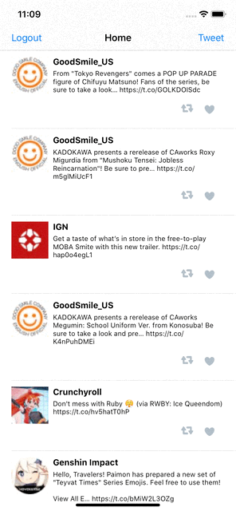

# Witter - Part II

> [!IMPORTANT] 
> This project was created for learning purposes only. ***Please refrain from copying, sharing, and/or using any of my work.*** Thank you.

This is a basic twitter clone app to view, compose, favorite, and retweet tweets.

Time spent: **10** hours spent in total

## User Stories

The following **required** functionality is completed:

- [x] User can compose a tweet. (4pts)
- [x] User can favorite a tweet. (4pts)
- [x] User can retweet a tweet. (2pts)

## Video Walkthrough

Here's a walkthrough of implemented user stories:

**Please note that you will have to give GitHub few seconds to properly load this repository before the GIF shows up correctly.** 

---

# Witter - Part I

> [!IMPORTANT] 
> This project was created for learning purposes only. ***Please refrain from copying, sharing, and/or using any of my work.*** Thank you.

This is a basic twitter clone app to read your tweets.

Time spent: **9** hours spent in total

## User Stories

The following **required** functionality is completed:

- [x] User sees app icon in home screen and styled launch screen. (1pt)
- [x] User can log in. (1pt)
- [x] User can log out. (1pt)
- [x] User stays logged in across restarts. (1pt)
- [x] User can view tweets with the user profile picture, username, and tweet text. (6pts)

The following **bonus** features are implemented:

- [x] User can pull to refresh. (1pt)
- [x] User can load past tweets infinitely. (2pts)

## Video Walkthrough

Here's a walkthrough of implemented user stories:

**Please note that you will have to give GitHub few seconds to properly load this repository before the GIF shows up correctly.** 
